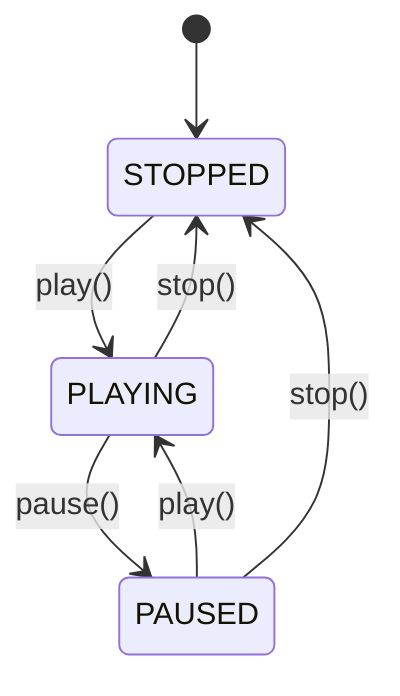
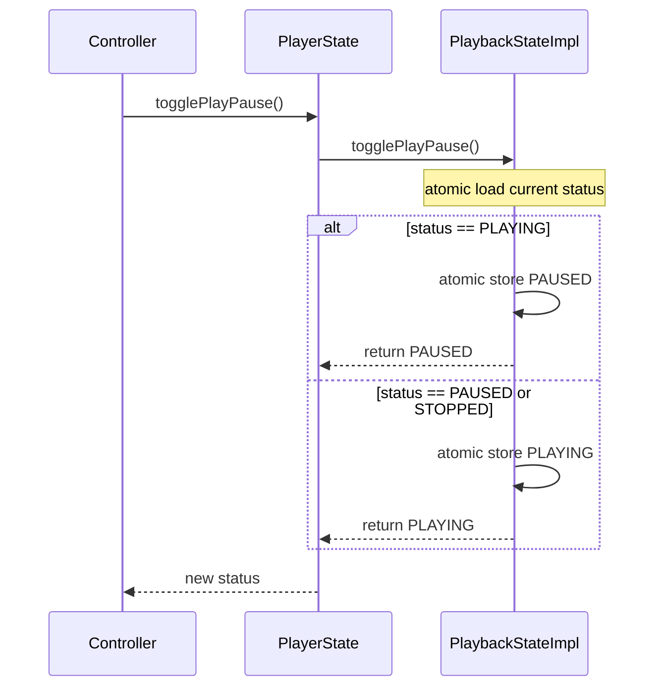
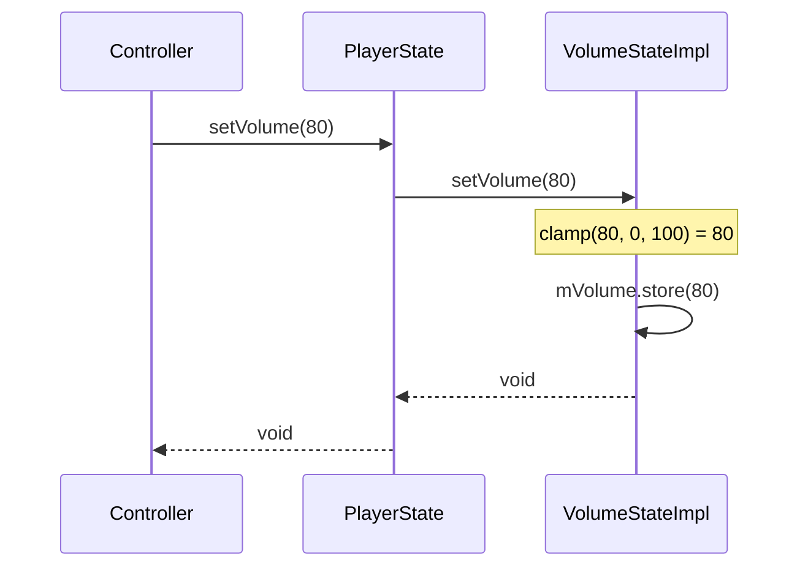
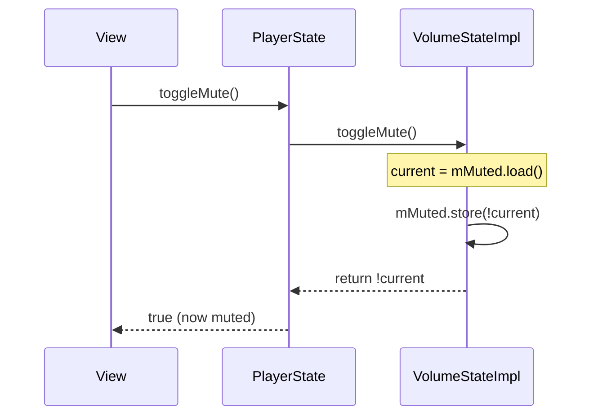
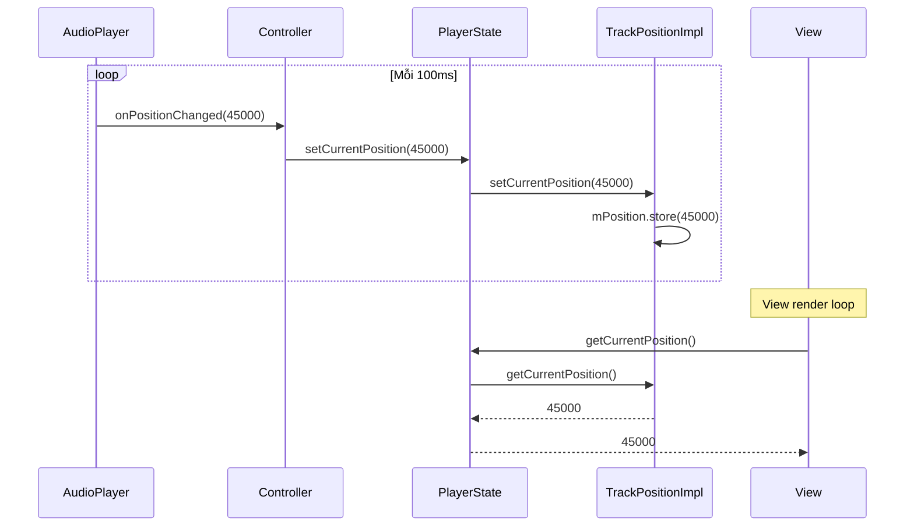
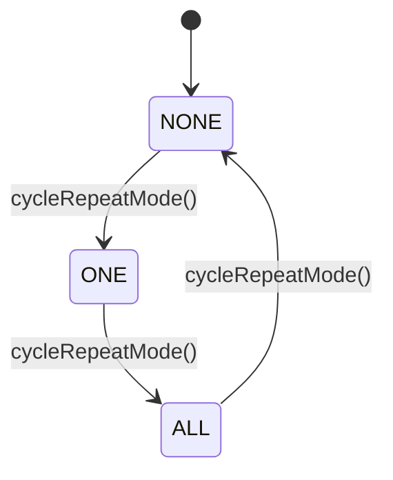
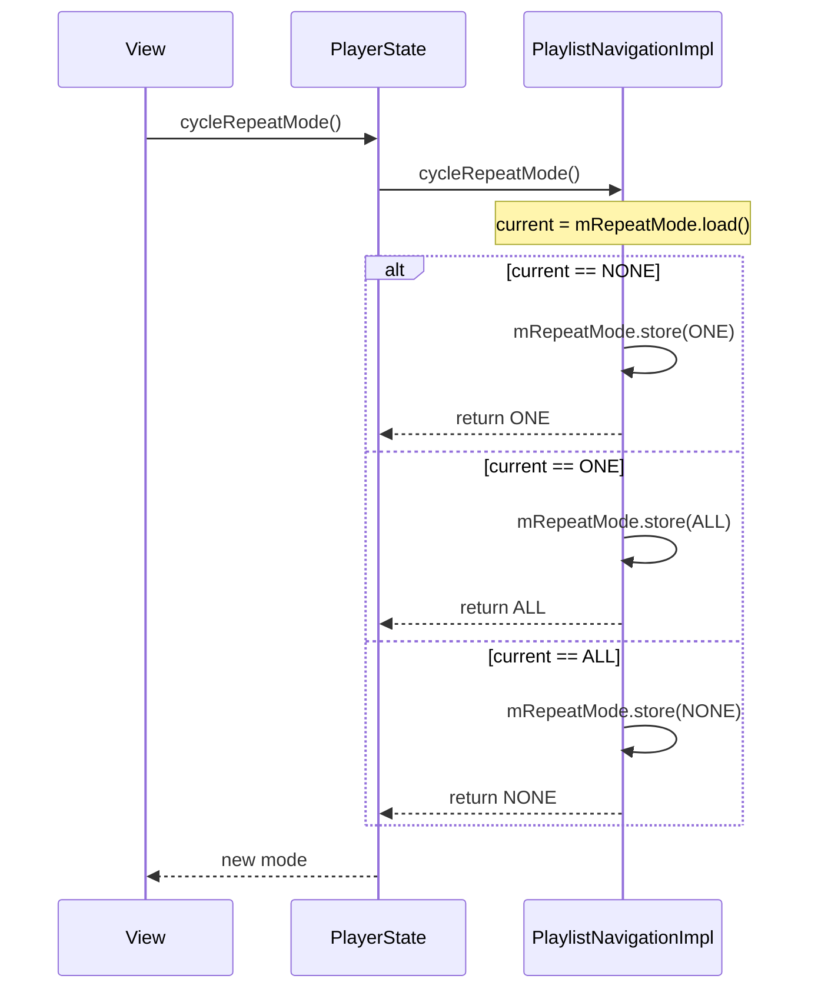
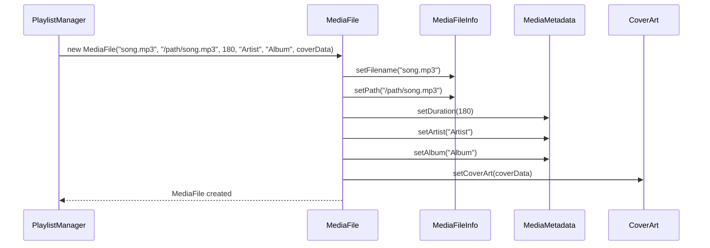
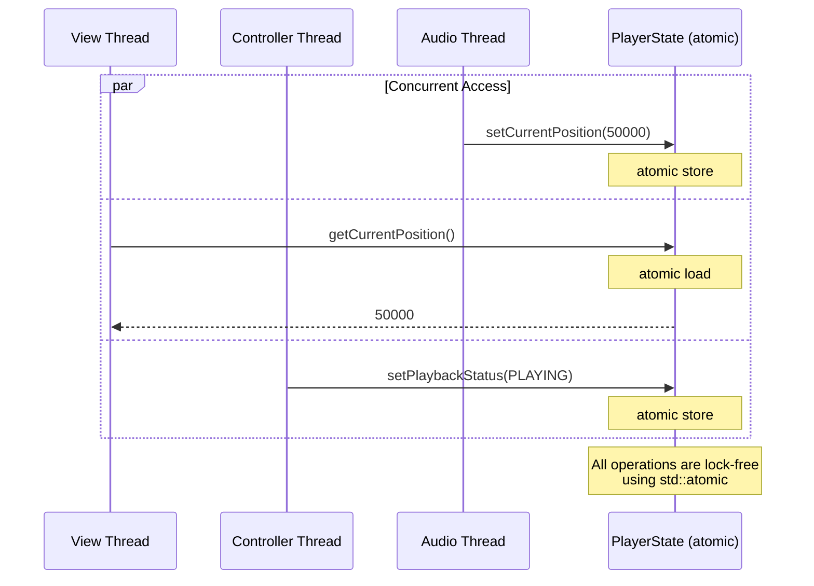

# Model Layer - Detailed Documentation

## Tổng quan

Thư mục `src/model` chứa các thành phần dữ liệu và trạng thái ứng dụng. Layer này:
- Lưu trữ trạng thái player (đang phát, volume, vị trí...)
- Lưu trữ thông tin media file (tên, artist, duration...)
- Được đọc bởi **View** và ghi bởi **Controller**
- **Thread-safe** hoàn toàn với atomic operations

---

## Cấu trúc thư mục

```
src/model/
├── IMediaFile.h                # Aggregate interface
├── MediaFile.h/cpp             # Facade implementation
├── IPlayerState.h              # Aggregate interface
├── PlayerState.h/cpp           # Facade implementation
├── mediafile/
│   ├── CoverArt.h/cpp              # Cover art data
│   ├── MediaFileInfo.h/cpp         # File name, path
│   ├── MediaMetadata.h/cpp         # Artist, album, duration
│   └── interfaces/
│       ├── ICoverArt.h
│       ├── IMediaFileInfo.h
│       └── IMediaMetadata.h
└── playerstate/
    ├── PlaybackStateImpl.h/cpp     # PLAYING/PAUSED/STOPPED
    ├── VolumeStateImpl.h/cpp       # Volume (0-100), muted
    ├── TrackPositionImpl.h/cpp     # Current position (ms)
    ├── PlaylistNavigationImpl.h/cpp # Track index, repeat, shuffle
    └── interfaces/
        ├── IPlaybackState.h
        ├── IVolumeState.h
        ├── ITrackPosition.h
        └── IPlaylistNavigation.h
```

---

## Features & Use Cases

### UC-M01: Quản lý trạng thái Playback

| Thuộc tính | Mô tả |
|------------|-------|
| **Component** | PlaybackStateImpl |
| **Interface** | IPlaybackState |
| **States** | STOPPED, PLAYING, PAUSED |
| **Thread-Safety** | std::atomic\<int\> |

**Operations:**

| Method | Mô tả | Return |
|--------|-------|--------|
| `getPlaybackStatus()` | Lấy trạng thái hiện tại | PlaybackStatus |
| `setPlaybackStatus(status)` | Đặt trạng thái mới | void |
| `isPlaying()` | Kiểm tra đang phát | bool |
| `togglePlayPause()` | Chuyển đổi Play/Pause | PlaybackStatus |

**State Diagram:**


**Sequence Diagram - Toggle Play/Pause:**


---

### UC-M02: Quản lý Volume

| Thuộc tính | Mô tả |
|------------|-------|
| **Component** | VolumeStateImpl |
| **Interface** | IVolumeState |
| **Range** | 0 - 100 |
| **Thread-Safety** | std::atomic\<int\>, std::atomic\<bool\> |

**Operations:**

| Method | Mô tả | Return |
|--------|-------|--------|
| `getVolume()` | Lấy volume hiện tại (0-100) | int |
| `setVolume(volume)` | Đặt volume (auto clamp 0-100) | void |
| `isMuted()` | Kiểm tra mute | bool |
| `setMuted(muted)` | Đặt trạng thái mute | void |
| `toggleMute()` | Chuyển đổi mute | bool |

**Sequence Diagram - Set Volume:**


**Sequence Diagram - Toggle Mute:**


---

### UC-M03: Quản lý vị trí Track

| Thuộc tính | Mô tả |
|------------|-------|
| **Component** | TrackPositionImpl |
| **Interface** | ITrackPosition |
| **Unit** | Milliseconds |
| **Thread-Safety** | std::atomic\<uint32_t\> |

**Operations:**

| Method | Mô tả | Return |
|--------|-------|--------|
| `getCurrentPosition()` | Lấy vị trí hiện tại (ms) | uint32_t |
| `setCurrentPosition(pos)` | Đặt vị trí mới | void |

**Sequence Diagram - Update Position (from AudioPlayer):**


---

### UC-M04: Điều hướng Playlist

| Thuộc tính | Mô tả |
|------------|-------|
| **Component** | PlaylistNavigationImpl |
| **Interface** | IPlaylistNavigation |
| **Thread-Safety** | std::atomic cho tất cả fields |

**Operations:**

| Method | Mô tả | Return |
|--------|-------|--------|
| `getCurrentTrackIndex()` | Index track đang phát (-1 nếu không có) | int |
| `setCurrentTrackIndex(index)` | Đặt track index | void |
| `getRepeatMode()` | Lấy chế độ lặp | RepeatMode |
| `setRepeatMode(mode)` | Đặt chế độ lặp | void |
| `cycleRepeatMode()` | Xoay vòng: NONE→ONE→ALL→NONE | RepeatMode |
| `isShuffleEnabled()` | Kiểm tra shuffle | bool |
| `toggleShuffle()` | Bật/tắt shuffle | bool |

**Repeat Mode State Diagram:**


**Sequence Diagram - Cycle Repeat Mode:**


---

### UC-M05: Lưu trữ thông tin MediaFile

| Thuộc tính | Mô tả |
|------------|-------|
| **Component** | MediaFile (Facade) |
| **Sub-components** | MediaFileInfo, MediaMetadata, CoverArt |

**Operations:**

| Interface | Method | Mô tả |
|-----------|--------|-------|
| IMediaFileInfo | `getFilename()` | Tên file (e.g., "song.mp3") |
| IMediaFileInfo | `getPath()` | Đường dẫn đầy đủ |
| IMediaFileInfo | `isValid()` | Kiểm tra file hợp lệ |
| IMediaMetadata | `getDuration()` | Độ dài (seconds) |
| IMediaMetadata | `getArtist()` | Tên artist |
| IMediaMetadata | `getAlbum()` | Tên album |
| ICoverArt | `getCoverArt()` | Dữ liệu ảnh cover |
| ICoverArt | `hasCoverArt()` | Có cover art không |

**Sequence Diagram - Create MediaFile:**


---

## Class Diagram

```mermaid
classDiagram
    class IPlayerState {
        <<interface>>
    }
    class IPlaybackState {
        <<interface>>
        +getPlaybackStatus() PlaybackStatus
        +setPlaybackStatus(status)
        +isPlaying() bool
        +togglePlayPause() PlaybackStatus
    }
    class IVolumeState {
        <<interface>>
        +getVolume() int
        +setVolume(volume)
        +isMuted() bool
        +toggleMute() bool
    }
    class ITrackPosition {
        <<interface>>
        +getCurrentPosition() uint32_t
        +setCurrentPosition(pos)
    }
    class IPlaylistNavigation {
        <<interface>>
        +getCurrentTrackIndex() int
        +getRepeatMode() RepeatMode
        +isShuffleEnabled() bool
    }
    
    class PlayerState {
        -mPlaybackState: PlaybackStateImpl
        -mVolumeState: VolumeStateImpl
        -mTrackPosition: TrackPositionImpl
        -mNavigation: PlaylistNavigationImpl
    }
    
    IPlayerState <|-- IPlaybackState
    IPlayerState <|-- IVolumeState
    IPlayerState <|-- ITrackPosition
    IPlayerState <|-- IPlaylistNavigation
    IPlayerState <|.. PlayerState
    
    class IMediaFile {
        <<interface>>
    }
    class IMediaFileInfo {
        <<interface>>
        +getFilename() string
        +getPath() string
        +isValid() bool
    }
    class IMediaMetadata {
        <<interface>>
        +getDuration() uint32_t
        +getArtist() string
        +getAlbum() string
    }
    class ICoverArt {
        <<interface>>
        +getCoverArt() vector~uint8_t~
        +hasCoverArt() bool
    }
    
    class MediaFile {
        -mFileInfo: MediaFileInfo
        -mMetadata: MediaMetadata
        -mCoverArt: CoverArt
    }
    
    IMediaFile <|-- IMediaFileInfo
    IMediaFile <|-- IMediaMetadata
    IMediaFile <|-- ICoverArt
    IMediaFile <|.. MediaFile
```



---

## Thread Safety Architecture



---

## Enums Reference

### PlaybackStatus

| Value | Int | Mô tả |
|-------|-----|-------|
| STOPPED | 0 | Không có media hoặc đã dừng |
| PLAYING | 1 | Đang phát |
| PAUSED | 2 | Tạm dừng |

### RepeatMode

| Value | Int | Mô tả |
|-------|-----|-------|
| NONE | 0 | Không lặp |
| ONE | 1 | Lặp bài hiện tại |
| ALL | 2 | Lặp toàn bộ playlist |

---

## Usage Examples

```cpp
// Tạo PlayerState
auto playerState = std::make_shared<PlayerState>();

// Playback control
playerState->setPlaybackStatus(PlaybackStatus::PLAYING);
if (playerState->isPlaying()) {
    playerState->pause(); // -> PAUSED
}

// Volume control
playerState->setVolume(80);
playerState->toggleMute(); // -> muted = true

// Position (cập nhật từ AudioPlayer callback)
playerState->setCurrentPosition(45000); // 45 seconds

// Navigation
playerState->setCurrentTrackIndex(3);
playerState->cycleRepeatMode(); // NONE -> ONE

// MediaFile
MediaFile track("song.mp3", "/music/song.mp3", 180, "Artist", "Album");
std::cout << track.getFilename(); // "song.mp3"
std::cout << track.getDuration(); // 180
```
