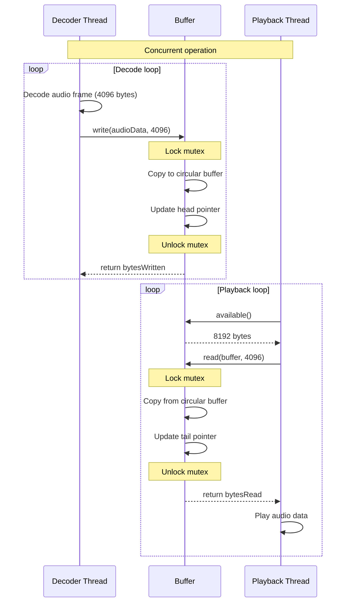
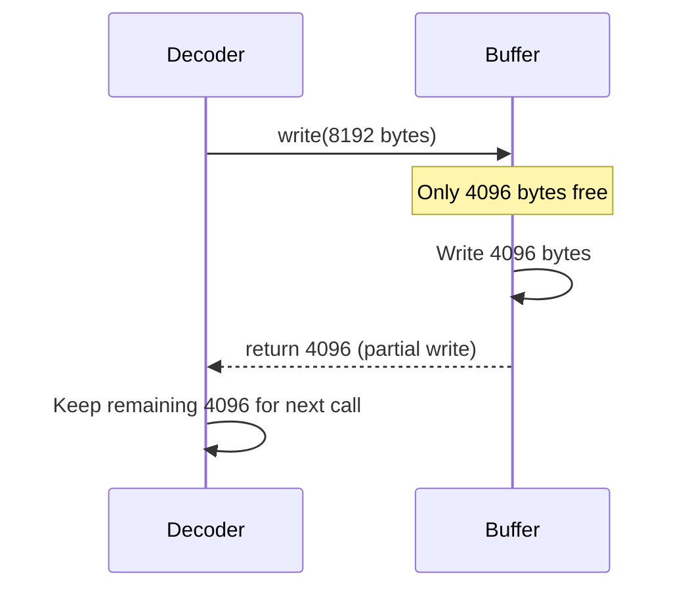
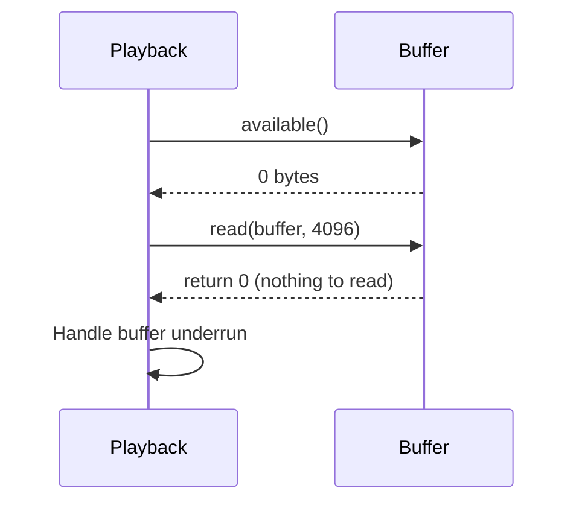
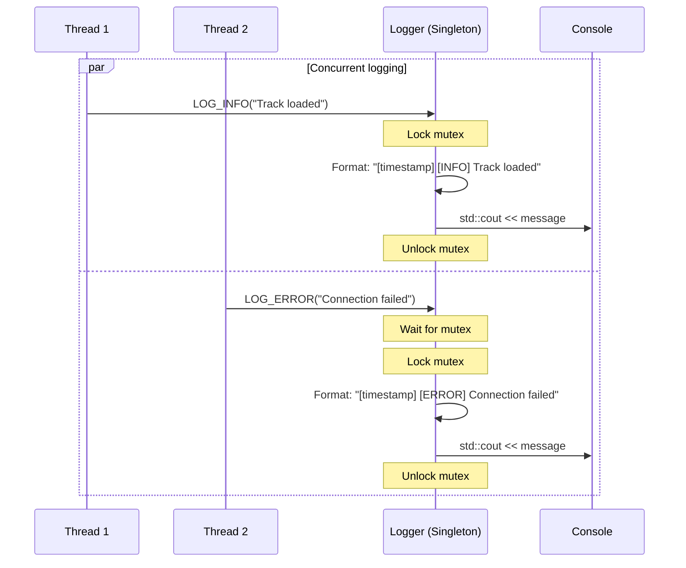
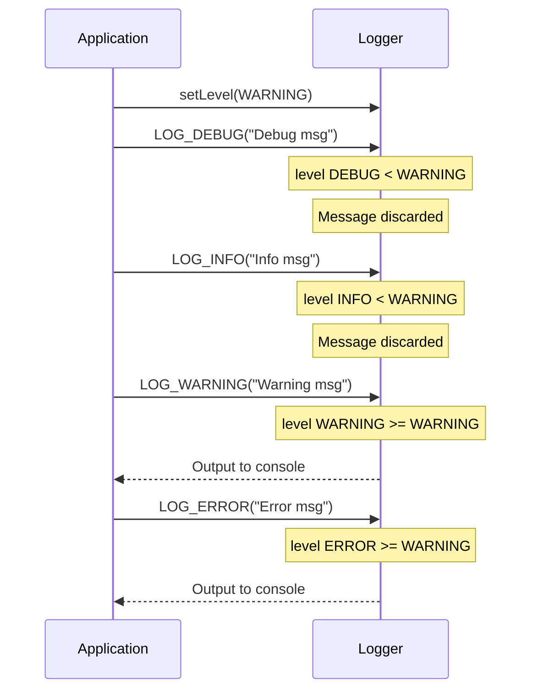
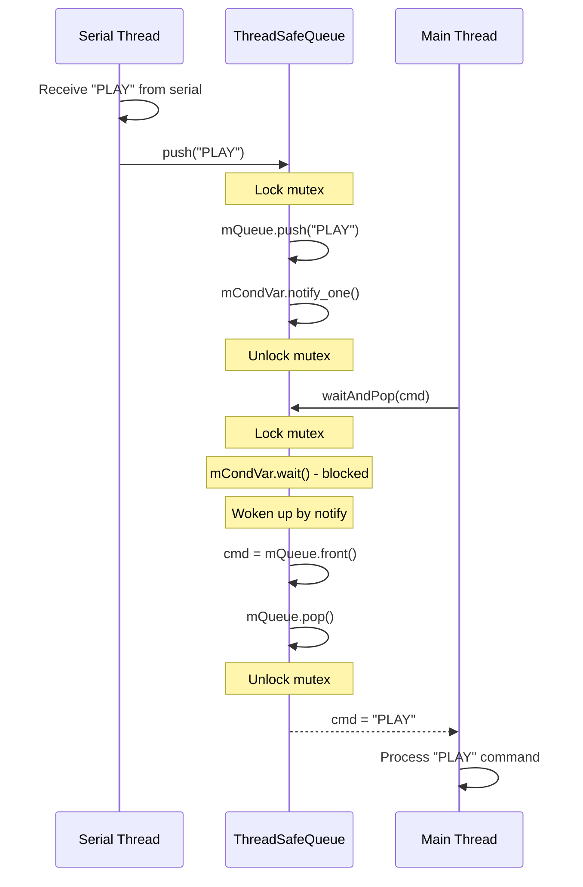
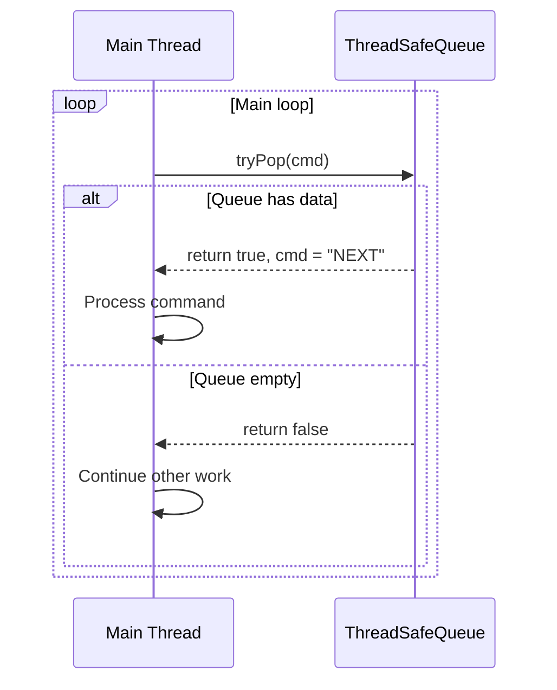
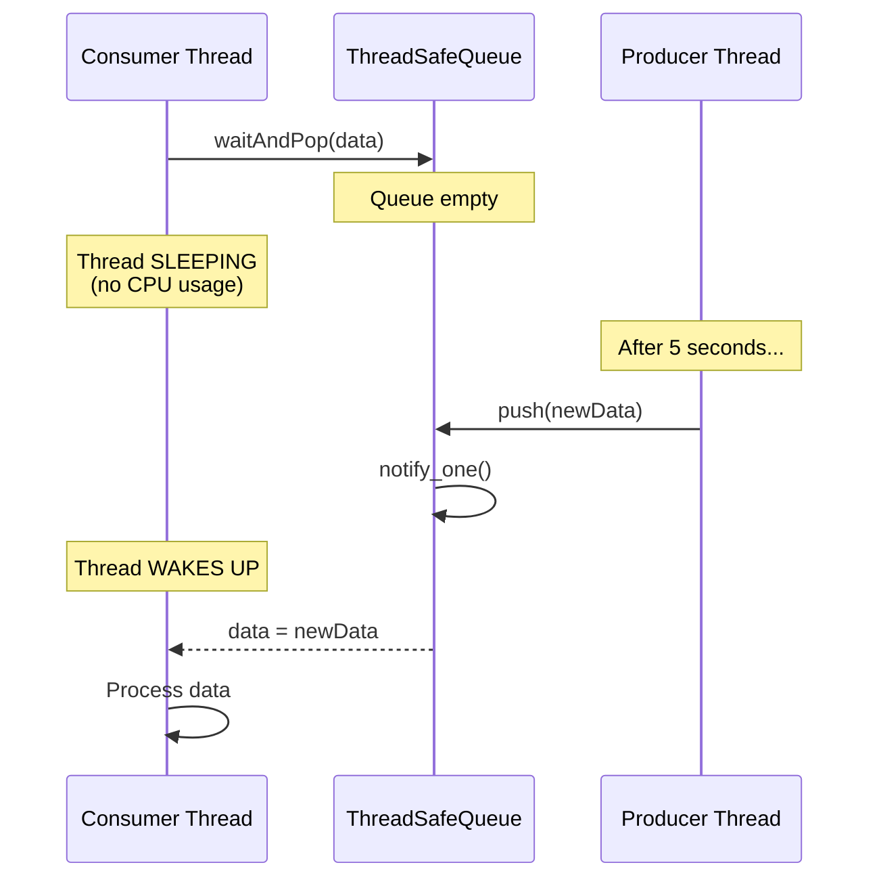
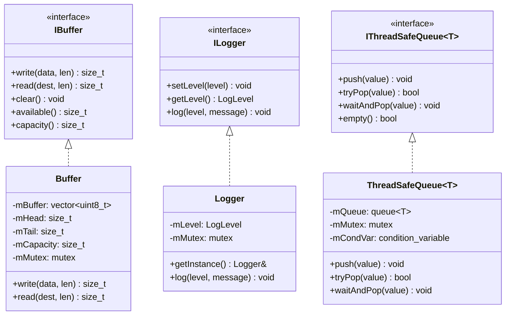

# Utils Layer - Detailed Documentation

## Tổng quan

Thư mục `src/utils` chứa các utility classes dùng chung cho toàn ứng dụng:
- **Buffer**: Circular buffer cho audio streaming
- **Logger**: Thread-safe singleton logger
- **ThreadSafeQueue**: Hàng đợi cho inter-thread communication

Tất cả utilities đều **thread-safe**.

---

## Cấu trúc thư mục

```
src/utils/
├── IBuffer.h               # Buffer interface
├── Buffer.h/cpp            # Circular buffer implementation
├── ILogger.h               # Logger interface
├── Logger.h/cpp            # Singleton logger
├── IThreadSafeQueue.h      # Queue interface
└── ThreadSafeQueue.h       # Template queue implementation
```

---

## Buffer (Circular Buffer)

### Mô tả

Circular buffer dùng cho **Producer-Consumer pattern** trong audio streaming:
- **Producer**: Decoder thread ghi audio data
- **Consumer**: Playback thread đọc audio data

### Interface

```cpp
class IBuffer {
    virtual size_t write(const uint8_t* data, size_t len) = 0;
    virtual size_t read(uint8_t* dest, size_t len) = 0;
    virtual void clear() = 0;
    virtual size_t available() const = 0;
    virtual size_t capacity() const = 0;
};
```

### Use Case: UC-U01 - Audio Streaming

| Thuộc tính | Mô tả |
|------------|-------|
| **Actors** | Decoder Thread (Producer), Playback Thread (Consumer) |
| **Mô tả** | Truyền audio data giữa decoder và playback |
| **Buffer Size** | 1MB (default) |
| **Thread-Safety** | std::mutex protection |

**Sequence Diagram - Audio Streaming:**


**Circular Buffer Diagram:**
```
┌─────────────────────────────────────────────┐
│  Circular Buffer (1MB)                       │
├─────────────────────────────────────────────┤
│                                              │
│   ████ TAIL ────────────────► HEAD ████     │
│        ↑                        ↑            │
│     Consumer                 Producer        │
│      reads                    writes         │
│                                              │
│   [USED DATA]              [FREE SPACE]      │
└─────────────────────────────────────────────┘
```

### Use Case: UC-U02 - Buffer Full Handling

| Thuộc tính | Mô tả |
|------------|-------|
| **Scenario** | Producer writes faster than consumer reads |
| **Behavior** | Non-blocking, returns bytes actually written |

**Sequence Diagram:**


### Use Case: UC-U03 - Buffer Empty Handling

| Thuộc tính | Mô tả |
|------------|-------|
| **Scenario** | Consumer reads faster than producer writes |
| **Behavior** | Returns 0 bytes, no blocking |

**Sequence Diagram:**


---

## Logger (Thread-Safe Singleton)

### Mô tả

Hệ thống logging với:
- 4 log levels: DEBUG, INFO, WARNING, ERROR
- Thread-safe với mutex
- Singleton pattern

### Interface

```cpp
enum class LogLevel { DEBUG, INFO, WARNING, ERROR };

class ILogger {
    virtual void setLevel(LogLevel level) = 0;
    virtual LogLevel getLevel() const = 0;
    virtual void log(LogLevel level, const std::string& message) = 0;
};
```

### Macros

```cpp
LOG_DEBUG(msg);   // [DEBUG] message
LOG_INFO(msg);    // [INFO] message
LOG_WARNING(msg); // [WARNING] message
LOG_ERROR(msg);   // [ERROR] message
```

### Use Case: UC-U04 - Application Logging

| Thuộc tính | Mô tả |
|------------|-------|
| **Actors** | Tất cả components trong ứng dụng |
| **Mô tả** | Ghi log messages với timestamp và level |
| **Output** | Console (stdout) |

**Sequence Diagram - Logging từ nhiều threads:**


### Use Case: UC-U05 - Log Level Filtering

| Thuộc tính | Mô tả |
|------------|-------|
| **Scenario** | Chỉ hiển thị log từ mức WARNING trở lên |
| **Config** | `Logger::getInstance().setLevel(LogLevel::WARNING)` |

**Sequence Diagram:**


---

## ThreadSafeQueue (Template)

### Mô tả

Hàng đợi thread-safe cho inter-thread communication:
- Producer push, Consumer pop
- Blocking và non-blocking options
- Condition variable cho efficient waiting

### Interface

```cpp
template <typename T>
class IThreadSafeQueue {
    virtual void push(const T& value) = 0;
    virtual bool tryPop(T& value) = 0;
    virtual void waitAndPop(T& value) = 0;
    virtual bool empty() const = 0;
};
```

### Use Case: UC-U06 - Command Queue

| Thuộc tính | Mô tả |
|------------|-------|
| **Actors** | Serial Thread (Producer), Main Thread (Consumer) |
| **Mô tả** | Truyền commands từ S32K board đến main thread |

**Sequence Diagram:**


### Use Case: UC-U07 - Non-blocking Poll

| Thuộc tính | Mô tả |
|------------|-------|
| **Scenario** | Main loop polls queue mà không block |
| **Method** | tryPop() |

**Sequence Diagram:**


### Use Case: UC-U08 - Blocking Wait

| Thuộc tính | Mô tả |
|------------|-------|
| **Scenario** | Dedicated consumer thread chờ data |
| **Method** | waitAndPop() - blocks until data available |
| **Benefit** | CPU efficient (thread sleeps instead of spinning) |

**Sequence Diagram:**


---

## Class Diagram



---

## Thread Safety Summary

| Utility | Protection | Pattern |
|---------|------------|---------|
| Buffer | std::mutex | Circular Buffer + Lock |
| Logger | std::mutex | Singleton + Lock |
| ThreadSafeQueue | std::mutex + std::condition_variable | Producer-Consumer |

---

## Usage Examples

### Buffer

```cpp
Utils::Buffer audioBuffer(1024 * 1024); // 1MB

// Producer (Decoder thread)
uint8_t decodedAudio[4096];
size_t written = audioBuffer.write(decodedAudio, 4096);

// Consumer (Playback thread)
uint8_t playbackBuffer[4096];
if (audioBuffer.available() >= 4096) {
    size_t read = audioBuffer.read(playbackBuffer, 4096);
    // Play audio
}

// Reset
audioBuffer.clear();
```

### Logger

```cpp
// Configure
Utils::Logger::getInstance().setLevel(Utils::LogLevel::DEBUG);

// Use macros
LOG_INFO("Application started");
LOG_DEBUG("Loading track: " << trackName);
LOG_WARNING("Buffer running low: " << available << " bytes");
LOG_ERROR("Failed to connect: " << errorMessage);

// Output:
// [2024-01-15 10:30:45] [INFO] Application started
// [2024-01-15 10:30:45] [DEBUG] Loading track: song.mp3
```

### ThreadSafeQueue

```cpp
Utils::ThreadSafeQueue<std::string> commandQueue;

// Producer (Serial thread)
void onSerialReceive(const std::string& cmd) {
    commandQueue.push(cmd);
}

// Consumer Option 1: Non-blocking
std::string cmd;
while (commandQueue.tryPop(cmd)) {
    processCommand(cmd);
}

// Consumer Option 2: Blocking (dedicated thread)
void commandProcessor() {
    std::string cmd;
    while (running) {
        commandQueue.waitAndPop(cmd); // Blocks efficiently
        processCommand(cmd);
    }
}
```
