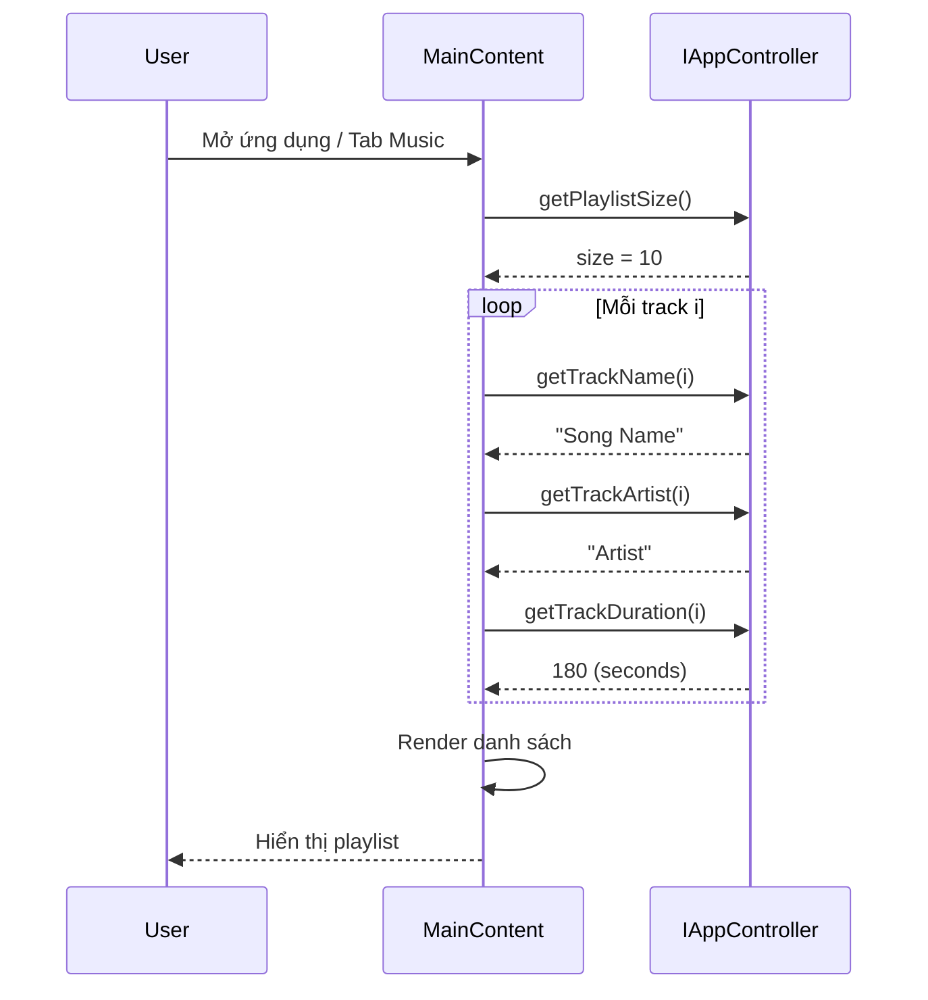
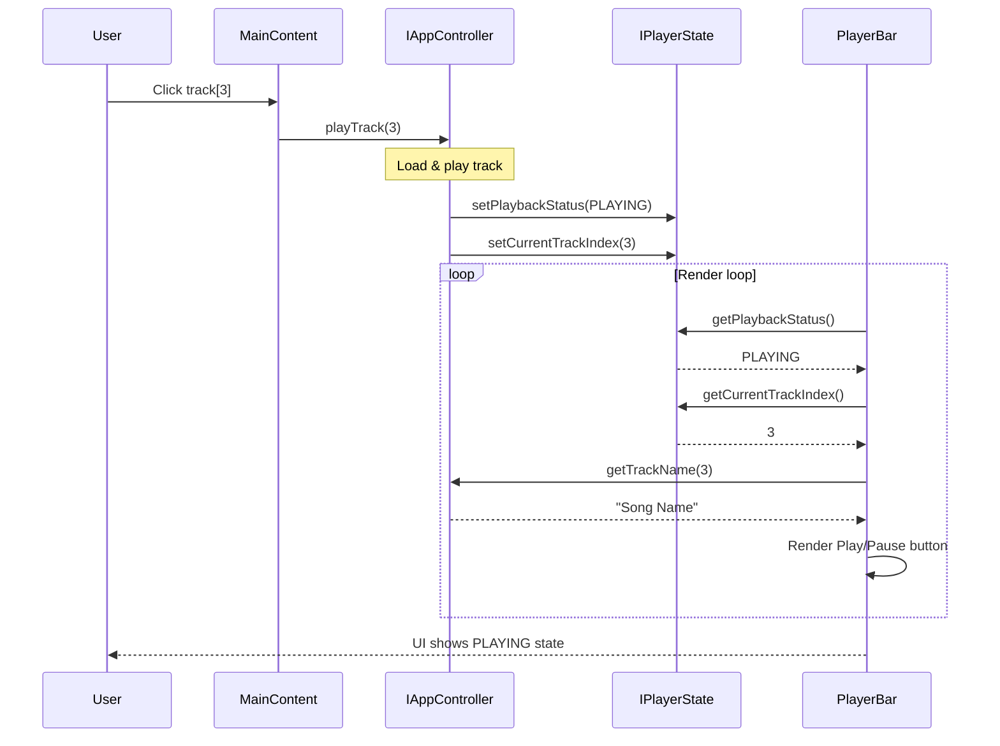
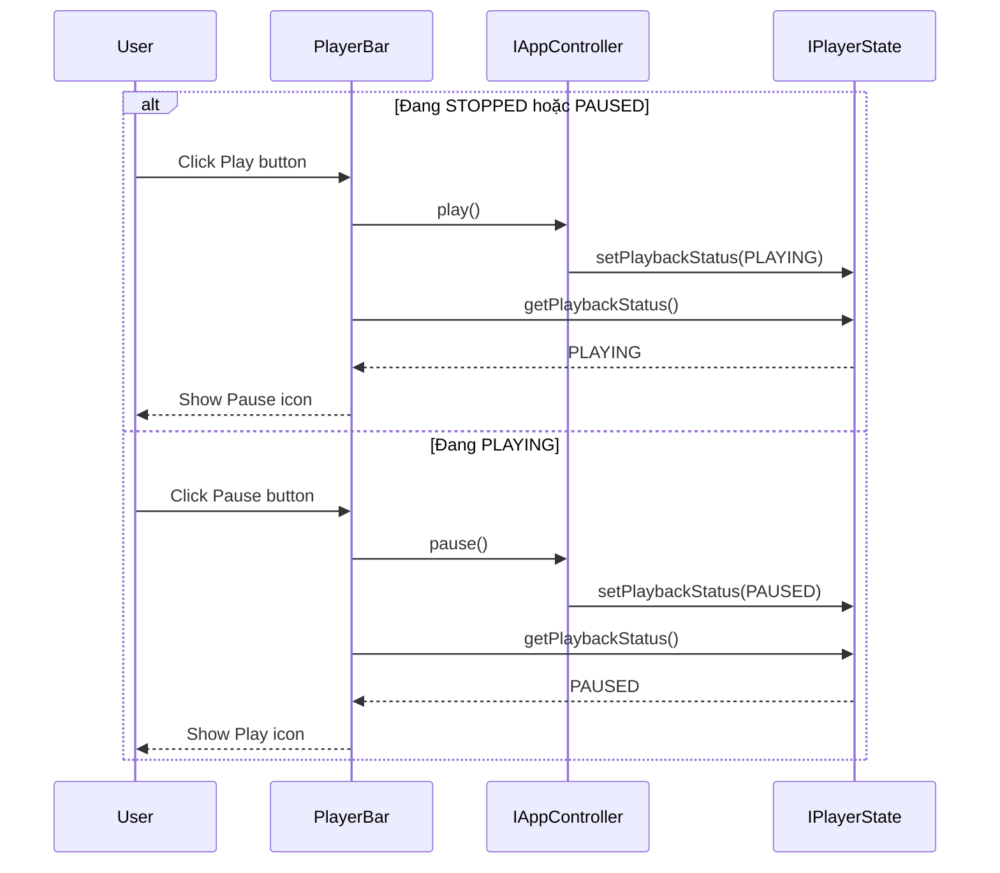
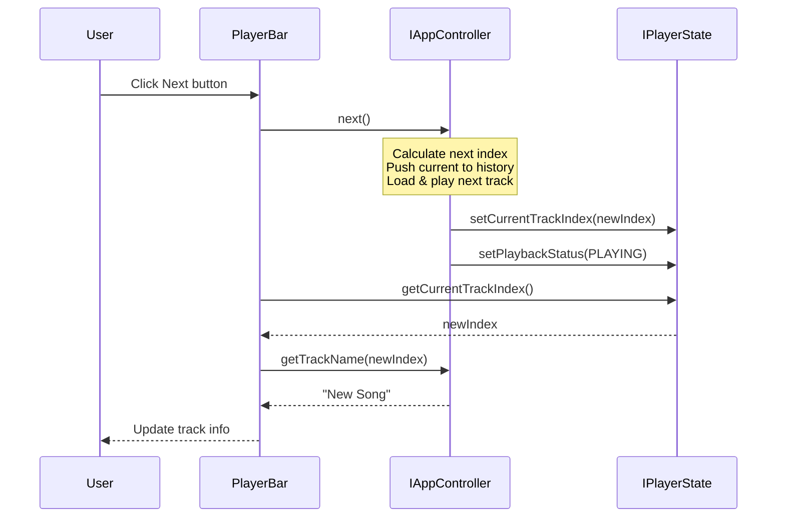
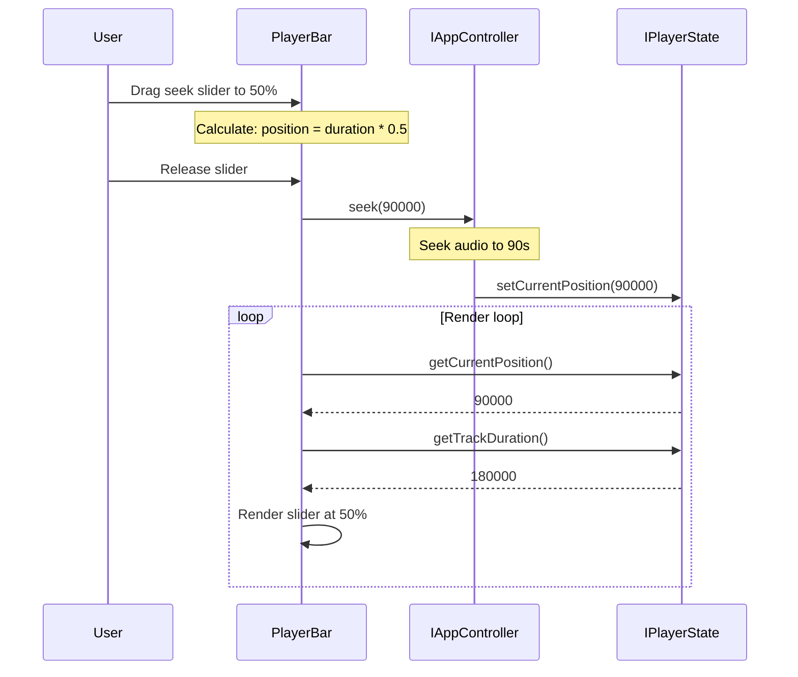
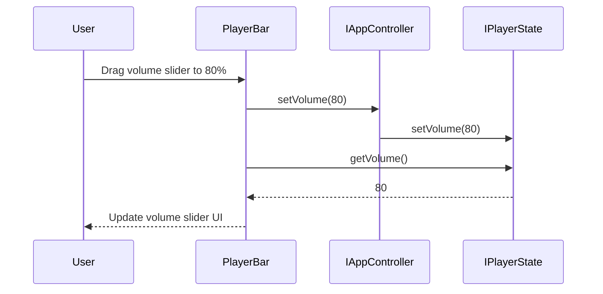
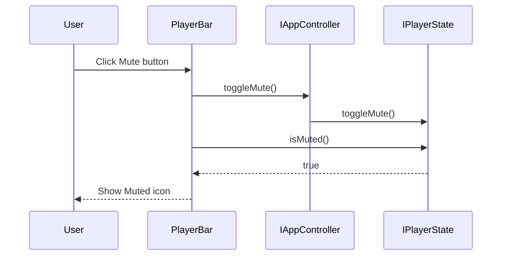
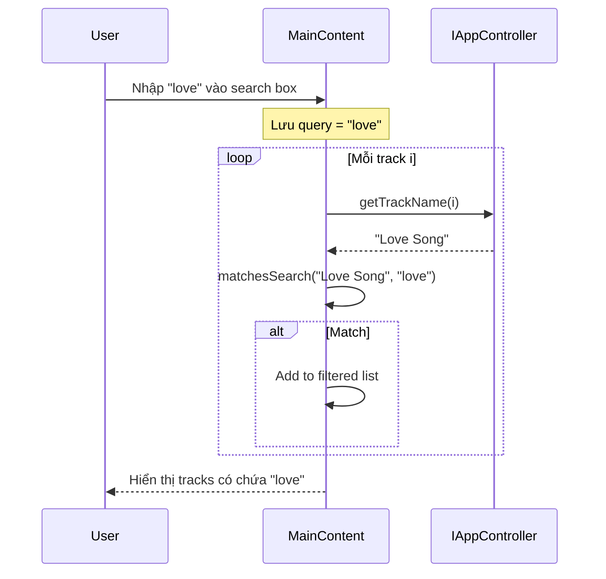
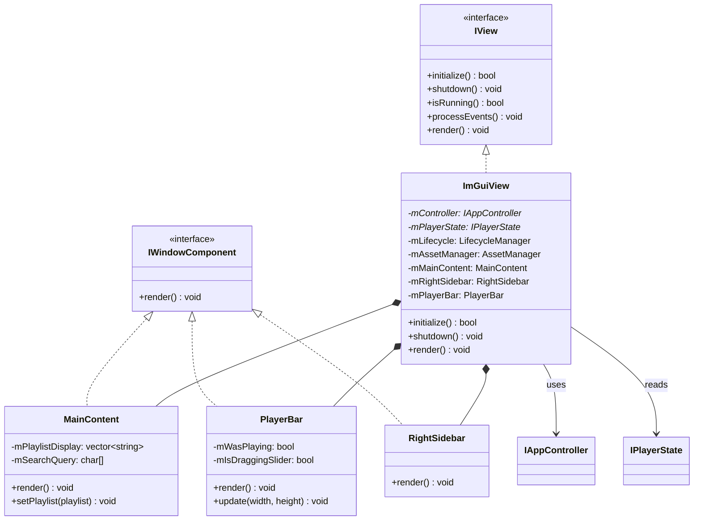
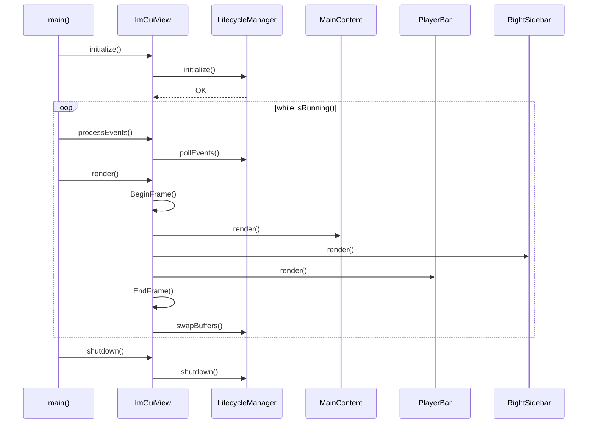

# View Layer - Detailed Documentation

## Tổng quan

Thư mục `src/view` chứa các thành phần giao diện người dùng (UI) của ứng dụng Music Player. Layer này:
- Hiển thị trạng thái từ **Model** (PlayerState)
- Gửi lệnh đến **Controller** (AppController)
- Sử dụng **ImGui** làm thư viện đồ họa

---

## Cấu trúc thư mục

```
src/view/
├── IView.h                     # Interface trừu tượng
├── ImGuiView.h/cpp             # Facade implementation
├── imgui/                      # Thư viện ImGui (third-party)
└── imguiview/
    ├── AssetManager.h/cpp          # Quản lý fonts, images
    ├── LifecycleManager.h/cpp      # GLFW/OpenGL lifecycle
    ├── components/
    │   ├── MainContent.h/cpp       # Playlist view, tabs
    │   ├── RightSidebar.h/cpp      # Track info, cover art
    │   └── PlayerBar.h/cpp         # Playback controls, seek bar
    └── interfaces/
        └── IWindowComponent.h      # Interface cho UI components
```

---

## Use Cases

### UC-V01: Hiển thị danh sách nhạc (Display Playlist)

| Thuộc tính | Mô tả |
|------------|-------|
| **Actor** | User |
| **Mô tả** | User xem danh sách các bài hát đã load |
| **Precondition** | Playlist đã được load từ thư mục |
| **Postcondition** | Danh sách nhạc hiển thị trên màn hình |

**Luồng chính:**
1. User mở ứng dụng
2. View gọi `controller->getPlaylistSize()` để lấy số lượng track
3. View gọi `controller->getTrackName(i)` cho mỗi track
4. MainContent render danh sách trong tab "Music"

**Sequence Diagram:**


---

### UC-V02: Chọn và phát bài hát (Select and Play Track)

| Thuộc tính | Mô tả |
|------------|-------|
| **Actor** | User |
| **Mô tả** | User click vào bài hát để phát |
| **Precondition** | Playlist không rỗng |
| **Postcondition** | Bài hát được phát, UI cập nhật trạng thái PLAYING |

**Luồng chính:**
1. User click vào track trong MainContent
2. View gọi `controller->playTrack(index)`
3. Controller load track và phát
4. Model cập nhật `PlaybackStatus = PLAYING`
5. PlayerBar đọc state và hiển thị nút Pause

**Sequence Diagram:**


---

### UC-V03: Điều khiển Play/Pause

| Thuộc tính | Mô tả |
|------------|-------|
| **Actor** | User |
| **Mô tả** | User click nút Play/Pause |
| **Precondition** | Có track đang được load |
| **Postcondition** | Trạng thái playback thay đổi |

**Luồng chính (Play):**
1. User click nút Play
2. PlayerBar gọi `controller->play()`
3. Controller phát nhạc
4. Model cập nhật `PlaybackStatus = PLAYING`
5. PlayerBar đọc state, đổi icon thành Pause

**Luồng thay thế (Pause):**
1. User click nút Pause (khi đang PLAYING)
2. PlayerBar gọi `controller->pause()`
3. Model cập nhật `PlaybackStatus = PAUSED`
4. PlayerBar đổi icon thành Play

**Sequence Diagram:**


---

### UC-V04: Điều khiển Next/Previous

| Thuộc tính | Mô tả |
|------------|-------|
| **Actor** | User |
| **Mô tả** | User chuyển bài tiếp theo/trước đó |
| **Precondition** | Playlist có nhiều hơn 1 track |
| **Postcondition** | Track mới được phát |

**Sequence Diagram:**


---

### UC-V05: Điều chỉnh Seek Bar

| Thuộc tính | Mô tả |
|------------|-------|
| **Actor** | User |
| **Mô tả** | User kéo seek bar để thay đổi vị trí phát |
| **Precondition** | Có track đang phát hoặc pause |
| **Postcondition** | Vị trí phát được cập nhật |

**Luồng chính:**
1. User kéo slider trên seek bar
2. PlayerBar tính toán position mới (ms)
3. Khi release, gọi `controller->seek(positionMs)`
4. Controller gọi AudioPlayer seek
5. Model cập nhật `currentPosition`

**Sequence Diagram:**


---

### UC-V06: Điều chỉnh Volume

| Thuộc tính | Mô tả |
|------------|-------|
| **Actor** | User |
| **Mô tả** | User kéo slider để thay đổi âm lượng |
| **Precondition** | None |
| **Postcondition** | Volume được cập nhật (0-100) |

**Sequence Diagram:**


---

### UC-V07: Toggle Mute

| Thuộc tính | Mô tả |
|------------|-------|
| **Actor** | User |
| **Mô tả** | User click nút mute/unmute |
| **Precondition** | None |
| **Postcondition** | Trạng thái mute được toggle |

**Sequence Diagram:**


---

### UC-V08: Tìm kiếm bài hát (Search)

| Thuộc tính | Mô tả |
|------------|-------|
| **Actor** | User |
| **Mô tả** | User nhập từ khóa để lọc danh sách |
| **Precondition** | Playlist không rỗng |
| **Postcondition** | Danh sách được lọc theo từ khóa |

**Sequence Diagram:**


---

## Class Diagram



---

## Component Responsibilities

| Component | Trách nhiệm | Gọi Controller Methods | Đọc Model State |
|-----------|-------------|------------------------|-----------------|
| **MainContent** | Hiển thị playlist, tabs, search | `playTrack()`, `getTrackName()`, `getPlaylistSize()` | `getCurrentTrackIndex()` |
| **PlayerBar** | Điều khiển playback, seek, volume | `play()`, `pause()`, `next()`, `previous()`, `seek()`, `setVolume()`, `toggleMute()` | `getPlaybackStatus()`, `getCurrentPosition()`, `getVolume()`, `isMuted()` |
| **RightSidebar** | Hiển thị thông tin track hiện tại | `getTrackArtist()`, `getTrackAlbum()`, `getTrackCoverArt()` | `getCurrentTrackIndex()` |
| **AssetManager** | Load fonts, textures | - | - |
| **LifecycleManager** | Khởi tạo GLFW, OpenGL, ImGui | - | - |

---

## Main Loop Flow


