# Controller Layer - Detailed Documentation

## Tổng quan

Thư mục `src/controller` chứa logic điều khiển của ứng dụng Music Player:
- Nhận lệnh từ **View** (user interactions)
- Điều khiển **AudioPlayer** để phát nhạc
- Giao tiếp với **S32K Board** qua serial
- Cập nhật trạng thái vào **Model** (PlayerState)

---

## Cấu trúc thư mục

```
src/controller/
├── IAppController.h            # Aggregate interface
├── AppController.h/cpp         # Main facade
├── IAudioPlayer.h              # Audio interface
├── AudioPlayer.h/cpp           # Audio implementation
├── ISerialManager.h            # Serial interface
├── SerialManager.h/cpp         # Serial implementation
├── appcontroller/
│   ├── PlaybackController.h/cpp    # Play/Pause/Stop/Next/Previous
│   ├── VolumeController.h/cpp      # Volume/Mute control
│   ├── PlaylistManager.h/cpp       # Playlist operations
│   ├── HistoryManager.h/cpp        # Navigation history
│   ├── BoardCommunicator.h/cpp     # S32K communication
│   └── interfaces/
│       ├── IAppLifecycle.h
│       ├── IPlaybackController.h
│       ├── IVolumeController.h
│       ├── IPlaylistManager.h
│       ├── IHistoryManager.h
│       └── IBoardCommunicator.h
├── audioplayer/
│   ├── AudioLifecycleImpl.h/cpp
│   ├── AudioLoaderImpl.h/cpp
│   ├── AudioPlaybackImpl.h/cpp
│   ├── AudioVolumeImpl.h/cpp
│   └── interfaces/
└── serialmanager/
    ├── SerialConnectionImpl.h/cpp
    ├── SerialIOImpl.h/cpp
    └── interfaces/
```

---

## Features & Use Cases

---

### UC-C01: Khởi tạo ứng dụng (Initialize)

| Thuộc tính | Mô tả |
|------------|-------|
| **Actor** | Application |
| **Interface** | IAppLifecycle |
| **Method** | `initialize()` |
| **Postcondition** | AppState = RUNNING |

**Sequence Diagram:**
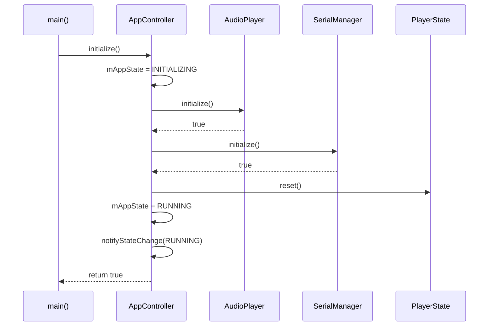

---

### UC-C02: Phát nhạc (Play)

| Thuộc tính | Mô tả |
|------------|-------|
| **Actor** | User (via View) |
| **Interface** | IPlaybackController |
| **Method** | `play()` |
| **Precondition** | Playlist không rỗng |
| **Postcondition** | PlaybackStatus = PLAYING |

**Luồng chính:**
1. View gọi `controller->play()`
2. PlaybackController kiểm tra có track đang load không
3. Nếu chưa có, load track đầu tiên trong playlist
4. Gọi AudioPlayer.play()
5. Cập nhật PlayerState.setPlaybackStatus(PLAYING)

**Sequence Diagram:**
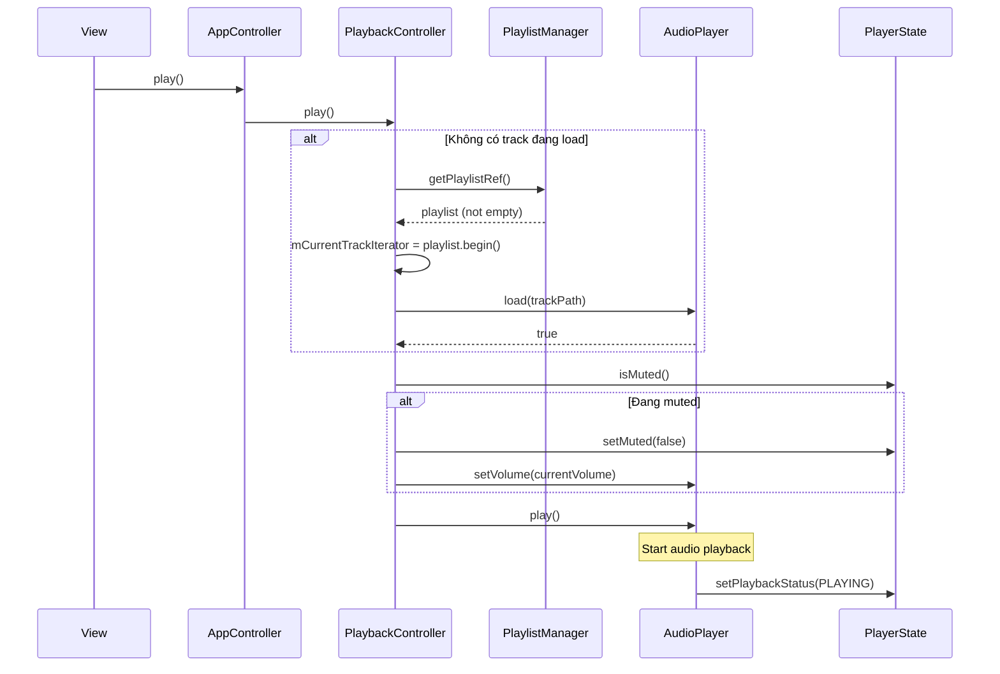

---

### UC-C03: Tạm dừng (Pause)

| Thuộc tính | Mô tả |
|------------|-------|
| **Actor** | User (via View) |
| **Interface** | IPlaybackController |
| **Method** | `pause()` |
| **Precondition** | PlaybackStatus = PLAYING |
| **Postcondition** | PlaybackStatus = PAUSED |

**Sequence Diagram:**
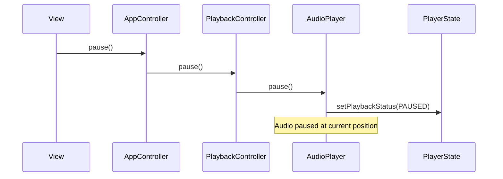

---

### UC-C04: Dừng phát (Stop)

| Thuộc tính | Mô tả |
|------------|-------|
| **Actor** | User (via View) |
| **Interface** | IPlaybackController |
| **Method** | `stop()` |
| **Postcondition** | PlaybackStatus = STOPPED, Position = 0 |

**Sequence Diagram:**
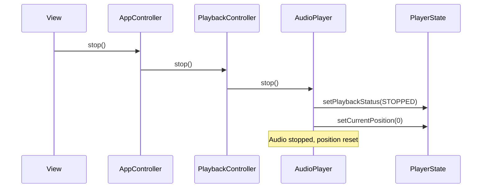

---

### UC-C05: Chuyển bài tiếp theo (Next)

| Thuộc tính | Mô tả |
|------------|-------|
| **Actor** | User (via View) hoặc S32K Board |
| **Interface** | IPlaybackController |
| **Method** | `next()` |
| **Precondition** | Playlist không rỗng |
| **Postcondition** | Track tiếp theo được phát |

**Luồng chính:**
1. Lưu track hiện tại vào history
2. Tăng track iterator (wrap around nếu cuối playlist)
3. Load track mới
4. Bắt đầu phát

**Sequence Diagram:**
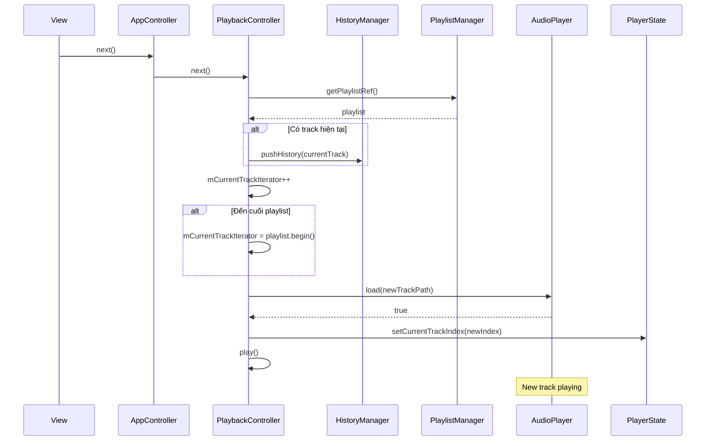

---

### UC-C06: Chuyển bài trước đó (Previous)

| Thuộc tính | Mô tả |
|------------|-------|
| **Actor** | User (via View) hoặc S32K Board |
| **Interface** | IPlaybackController |
| **Method** | `previous()` |
| **Behavior** | Kiểm tra history trước, nếu không có thì lùi playlist |

**Sequence Diagram:**
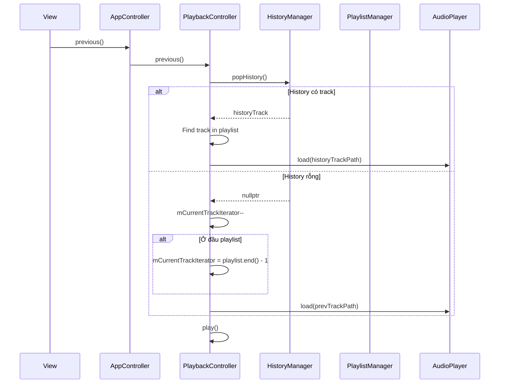

---

### UC-C07: Phát bài theo index (Play Track)

| Thuộc tính | Mô tả |
|------------|-------|
| **Actor** | User (click vào track trong playlist) |
| **Interface** | IPlaybackController |
| **Method** | `playTrack(int index)` |

**Sequence Diagram:**
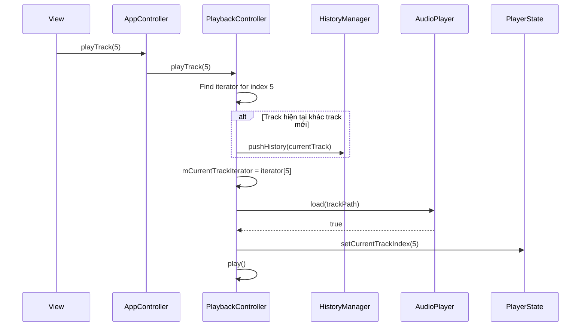

---

### UC-C08: Seek trong track

| Thuộc tính | Mô tả |
|------------|-------|
| **Actor** | User (kéo seek bar) |
| **Interface** | IPlaybackController |
| **Method** | `seek(uint32_t positionMs)` |
| **Unit** | Milliseconds |

**Sequence Diagram:**
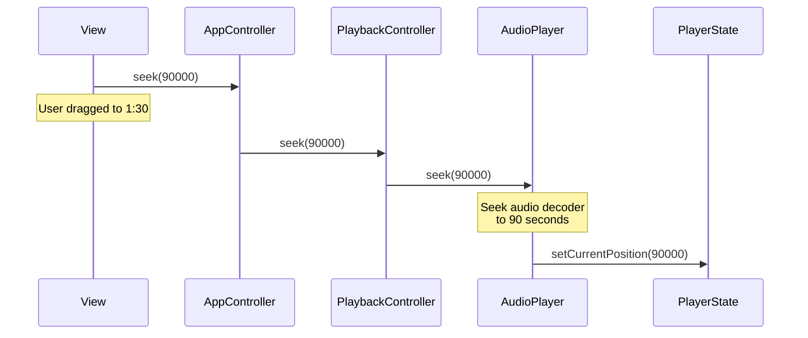

---

### UC-C09: Điều chỉnh Volume

| Thuộc tính | Mô tả |
|------------|-------|
| **Actor** | User hoặc S32K Board |
| **Interface** | IVolumeController |
| **Method** | `setVolume(int volume)` |
| **Range** | 0 - 100 |

**Sequence Diagram:**
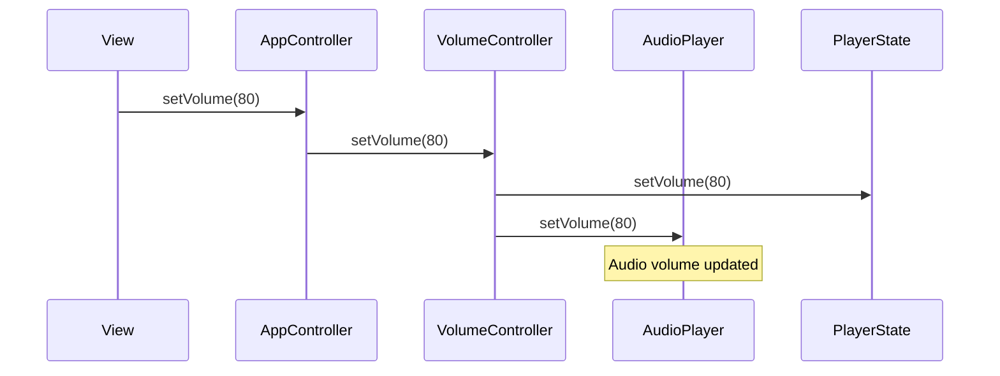

---

### UC-C10: Toggle Mute

| Thuộc tính | Mô tả |
|------------|-------|
| **Actor** | User |
| **Interface** | IVolumeController |
| **Method** | `toggleMute()` |

**Sequence Diagram:**
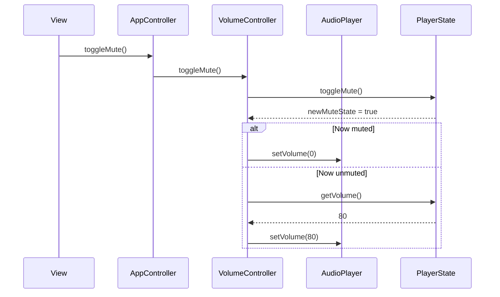

---

### UC-C11: Load thư mục nhạc

| Thuộc tính | Mô tả |
|------------|-------|
| **Actor** | Application (startup) |
| **Interface** | IPlaylistManager |
| **Method** | `loadDirectory(string path)` |
| **Return** | Số lượng tracks được load |

**Sequence Diagram:**
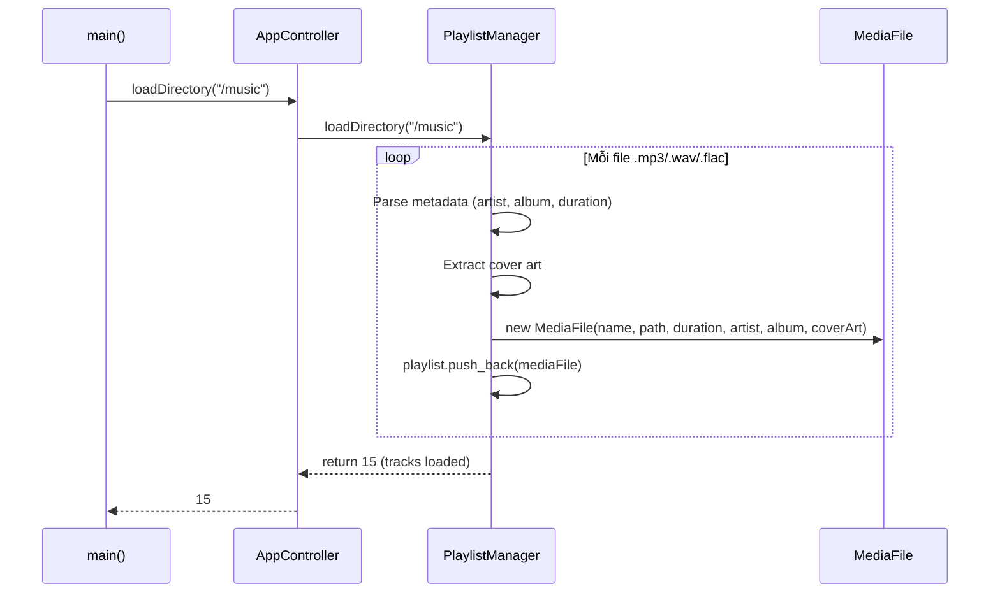

---

### UC-C12: Kết nối S32K Board

| Thuộc tính | Mô tả |
|------------|-------|
| **Actor** | Application hoặc User |
| **Interface** | IBoardCommunicator |
| **Method** | `connectToBoard(portName, baudRate)` |

**Sequence Diagram:**
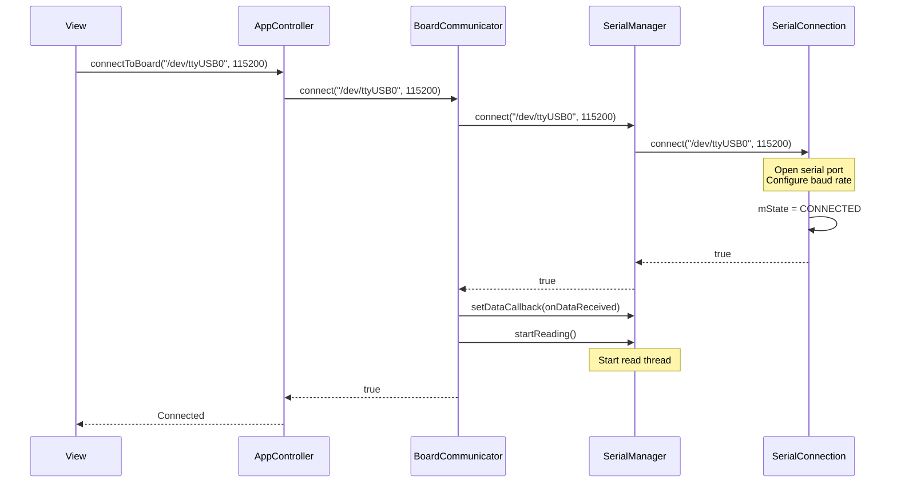

---

### UC-C13: Nhận lệnh từ S32K Board

| Thuộc tính | Mô tả |
|------------|-------|
| **Actor** | S32K Board (hardware) |
| **Trigger** | User xoay núm volume, nhấn nút |
| **Commands** | "PLAY", "PAUSE", "NEXT", "PREV", "VOL:80" |

**Sequence Diagram:**
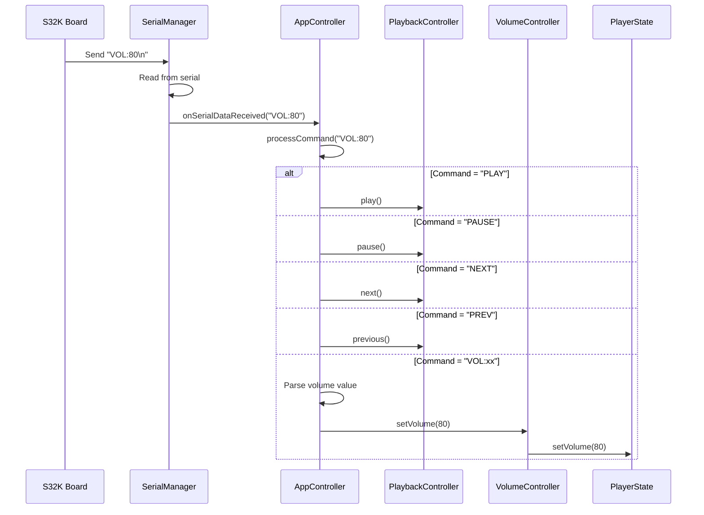

---

### UC-C14: Xử lý Track kết thúc

| Thuộc tính | Mô tả |
|------------|-------|
| **Actor** | AudioPlayer (internal) |
| **Trigger** | Track phát xong |
| **Behavior** | Phụ thuộc RepeatMode |

**Sequence Diagram:**
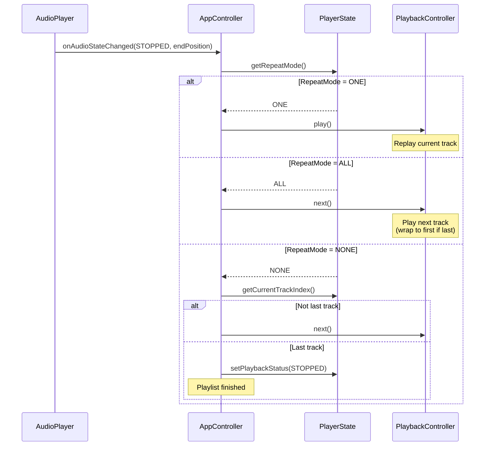

---

## Class Diagram

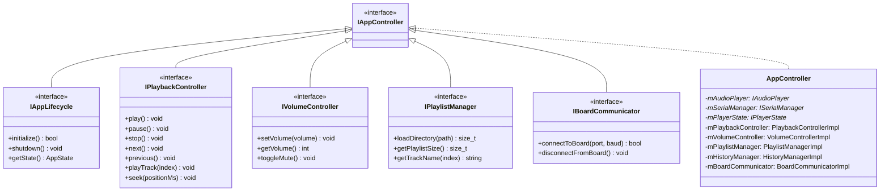

---

## State Diagram - AppState

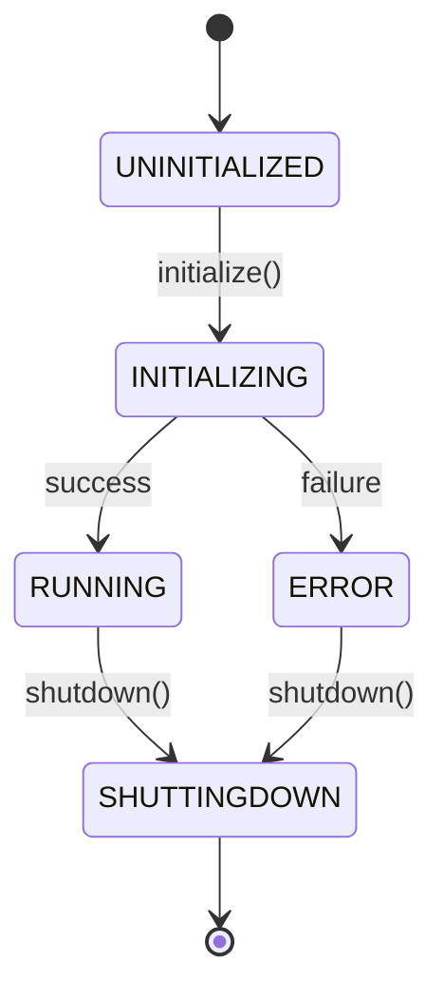

---

## Command Processing

| Command | Source | Action |
|---------|--------|--------|
| `PLAY` | S32K Board | `playbackController->play()` |
| `PAUSE` | S32K Board | `playbackController->pause()` |
| `STOP` | S32K Board | `playbackController->stop()` |
| `NEXT` | S32K Board | `playbackController->next()` |
| `PREV` | S32K Board | `playbackController->previous()` |
| `VOL:xx` | S32K Board | `volumeController->setVolume(xx)` |

---

## Dependencies Injection

```cpp
// Create dependencies
auto audioPlayer = std::make_shared<AudioPlayer>();
auto serialManager = std::make_shared<SerialManager>();
auto playerState = std::make_shared<PlayerState>();

// Inject into AppController
auto controller = std::make_shared<AppController>(
    audioPlayer,
    serialManager,
    playerState
);

// Initialize
controller->initialize();

// Load music
controller->loadDirectory("/path/to/music");

// Connect board (optional)
controller->connectToBoard("/dev/ttyUSB0", 115200);
```
